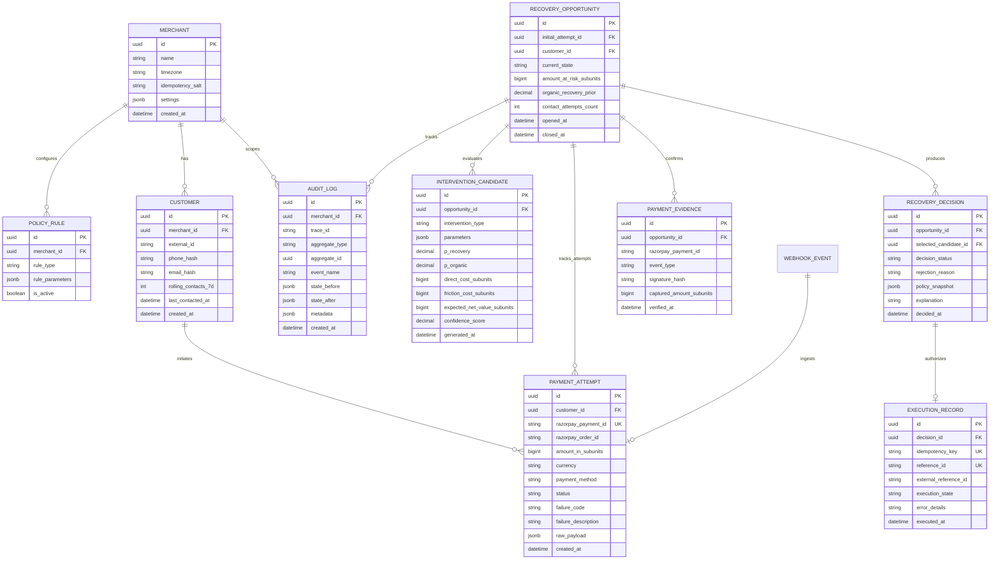
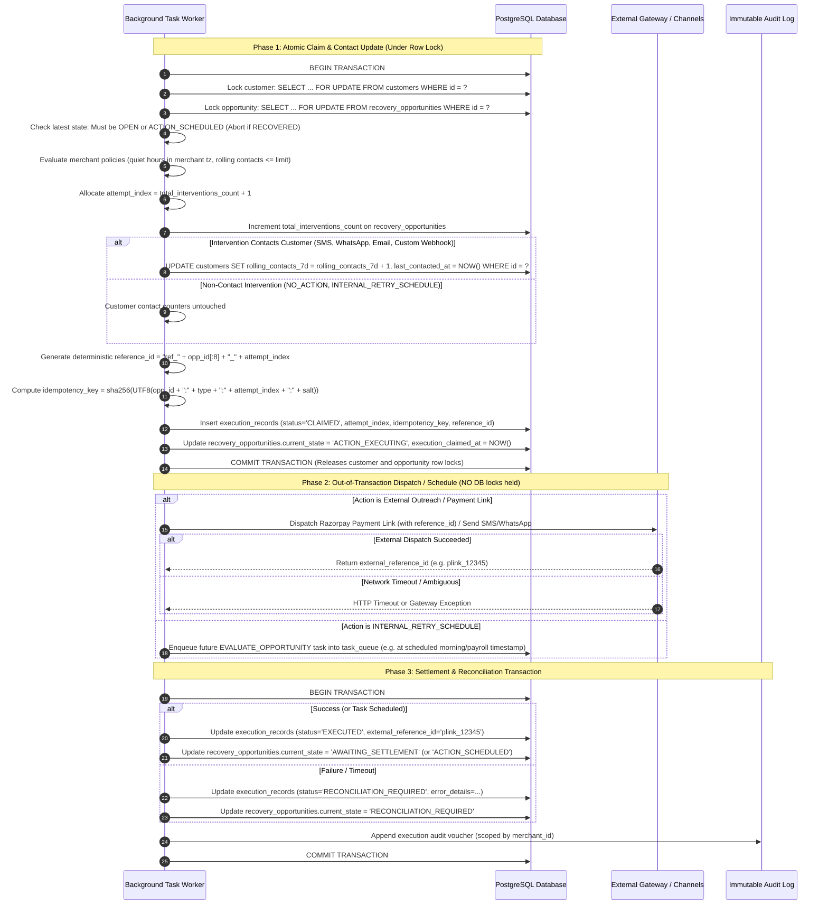
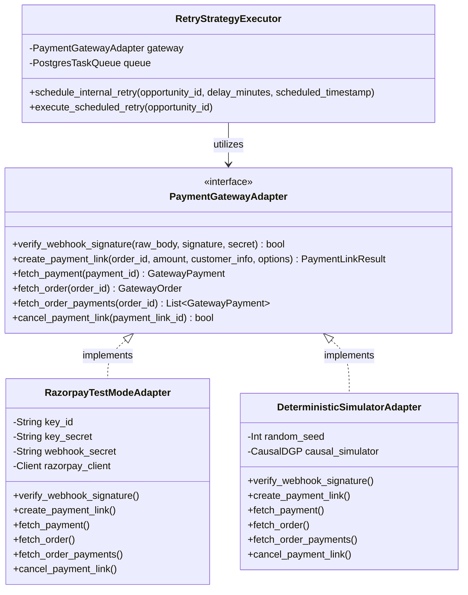

# Architecture & System Design Specification

**Document Status:** Pending Architecture Review
**Project:** Razorpay AI Buildathon 2026 — Track 03 (LIFT Engine)

---

## 1. Architectural Options Analysis & Recommendation

We evaluated three potential architectural topologies against the core requirements: correctness, security, low operational friction, deterministic safety boundaries, and clear evaluability.

| Criterion | Option 1: Single-Process Inline Monolith | Option 2: Modular Monolith + PostgreSQL Task Queue (Selected) | Option 3: Distributed Microservices |
| :--- | :--- | :--- | :--- |
| **Topology** | Single web process handling HTTP APIs, ML inference, and execution inline. | Web API service for ingestion and queries + persistent background worker using **PostgreSQL `FOR UPDATE SKIP LOCKED`** task queue. Shared database. | Separate microservices for Gateway, Decisioning, LLM Service, Policy Service, Audit Service. |
| **Complexity** | Minimal setup, but long-running LLM calls block HTTP request threads and webhooks. | Simple, zero extra infrastructure. No Redis/RabbitMQ brokers required. Single database coordinates state, audit, and queue. | High operational overhead, network latency, distributed transactions, eventual consistency pitfalls. |
| **Webhook Latency** | High risk: Razorpay webhooks expect `< 2000 ms` response; inline AI calls risk timeouts. | Excellent: Webhook ingestion verifies signature, deduplicates via `x-razorpay-event-id`, enqueues task in DB transaction, and returns HTTP 200 in `< 50 ms`. | Variable: Multi-hop RPC latency. |
| **Idempotency & Concurrency** | In-memory locks or basic DB transactions. | **PostgreSQL Pessimistic Row Locking (`SELECT ... FOR UPDATE`)** with atomic latest-state checks and deterministic idempotency vouchers. | Complex distributed saga or 2PC coordination required. |
| **Simulation & Evaluation** | Hard to run batch simulations without stalling live traffic. | Batch simulator runs through the exact same worker pipeline or standalone runner without modifying schema. | Requires orchestrating multiple mocked services. |
| **Maintenance & Cognitive Load** | Low, but poor separation of concerns between web and background tasks. | **Optimal**: High cohesion within modules, clear execution boundaries, zero separate broker daemons to maintain. | High: Deployment orchestration, protobufs/REST inter-service contracts. |

### Architectural Selection: Option 2 (Modular Monolith with PostgreSQL SKIP LOCKED Worker)
We select **Option 2**. It eliminates external queue brokers (Redis/RabbitMQ/Celery) by utilizing native PostgreSQL row-level skip-locked task queues (`SELECT ... FOR UPDATE SKIP LOCKED`). Webhook ingestion and task enqueueing occur within the **same local database transaction**, guaranteeing zero orphan tasks and zero dropped webhook events.

```mermaid
graph TD
    subgraph External_World [External Ecosystem]
        RZP[Razorpay APIs & Webhooks]
        Customer[Customer Devices / Channels]
        Ops[Merchant Billing Dashboard - 5s Polling]
    end

    subgraph LIFT_System [LIFT Revenue Recovery Engine - Single Tenant]
        subgraph Web_Tier [API & Ingestion Service]
            WH[Webhook Ingestion & Signature Verifier]
            API[REST API - Opportunities, Decisions, Lab]
        end

        subgraph Storage_Tier [PostgreSQL Unified Persistence Store]
            DB[(Relational Core: Opportunities, Attempts)]
            TaskQueue[(Postgres Task Queue: SKIP LOCKED)]
            AuditLog[(Append-Only Audit Log)]
            WebhookDedupe[(Webhook Events: x-razorpay-event-id UK)]
        end

        subgraph Worker_Tier [Background Worker & Decision Pipeline]
            SM[Opportunity State Machine]
            DE[Decision Engine & Economic Model NIRV]
            PolicyGate[Deterministic Policy Gate]
            SafeExec[Atomic Row-Locked Execution Gate]
            RetryExec[Internal RetryStrategyExecutor]
            Reaper[Stuck Worker & Reconciliation Reaper]
            SimRunner[Batch Simulation Runner]
        end

        subgraph AI_Tier [Constrained AI - Non-Authoritative]
            MLClassifier[Calibrated Tabular Failure Classifier]
            LLMGenerator[LLM Copy & Explanation Generator - No Action Authority]
        end
    end

    RZP -->|Webhook: x-razorpay-event-id| WH
    WH -->|HMAC-SHA256 & Deduplicate| WebhookDedupe
    WH -->|Transactional Enqueue| TaskQueue
    WH -->|200 OK in < 50ms| RZP
    Ops -->|Periodic Polling GET /opps| API
    API -->|Read-Only Queries| DB

    TaskQueue -->|Worker Claims: FOR UPDATE SKIP LOCKED (Transitions OPEN -> IN_EVALUATION)| SM
    SM -->|Evaluate Opportunity| DE
    DE -->|Classify Failure| MLClassifier
    DE -->|Estimate P_rec and P_org| DE
    DE -->|Calculate NIRV Slate| DE
    DE -->|Draft Outreach Copy & Explanation| LLMGenerator
    DE -->|Submit Candidate Slate| PolicyGate
    PolicyGate -->|Select Winning Permitted Action| SafeExec
    SafeExec -->|Phase 1: Lock customer & opp, update rolling_contacts_7d, CLAIMED voucher| DB
    SafeExec -->|Phase 2: Dispatch Razorpay Link with reference_id| RZP
    SafeExec -->|Phase 2: Internal Timed Retry Schedule Task Enqueued| RetryExec
    SafeExec -->|Phase 2: Dispatch Notification| Customer
    SafeExec -->|Phase 3: Update Execution Record & AWAITING_SETTLEMENT| DB
    SafeExec -->|Append Immutable Voucher with merchant_id| AuditLog
    Reaper -->|Sweep Stale IN_EVALUATION & ACTION_EXECUTING| DB
    Reaper -->|Reconcile Remote Payment Links via reference_id| RZP
    SimRunner -->|Run Synthetic Scenarios (Isolated DGP)| DE
```

---

## 2. Component Boundaries & Ownership

To prevent blurred responsibilities, each component enforces strict ownership:

| Component | Strict Responsibilities (Owns) | Explicit Prohibitions (Does NOT Own) |
| :--- | :--- | :--- |
| **Ingestion Layer** | Webhook signature verification (HMAC-SHA256), `x-razorpay-event-id` validation (reject missing with HTTP 400), deduplication, atomic task enqueueing, raw payload persistence. | Business decisioning, state transitions, customer outreach. |
| **Opportunity Manager** | Opportunity state machine, monotonic terminal states, associating multi-attempt sequences (`PaymentAttempt` $\rightarrow$ `RecoveryOpportunity`), updating `OPEN` $\rightarrow$ `IN_EVALUATION` on worker claim. | Calculating economic values or selecting interventions. |
| **Recovery Decision Engine** | Generating candidate intervention slates, estimating $P(\text{Rec} \mid a)$, estimating $P(\text{Organic} \mid \mathbf{x})$, computing NIRV scores with `AmountAtRisk` friction cost. | Authorizing execution, bypassing merchant policies, mutating payment truth. |
| **AI / LLM Layer** | Categorizing failure codes into taxonomy, drafting personalized notification copy, generating plain-language decision explanations. | **Selecting or authorizing interventions** (`recommended_intervention_type` strictly removed), calculating money, declaring recovery. |
| **Policy Engine** | Deterministic evaluation of merchant guardrails: frequency limits, quiet hours (merchant timezone), cooldowns, minimum amounts, selecting winning permitted intervention. | Modifying candidate economic formulas; inventing un-evaluated actions. |
| **Bounded Execution Layer** | PostgreSQL row-locking transaction boundary (customer lock + opportunity lock), atomic `rolling_contacts_7d` update, atomic `attempt_index` allocation, deterministic `reference_id` generation, idempotency vouchers with `idempotency_salt`, two-phase dispatch. | Deciding which intervention is best; inventing new parameters. |
| **RetryStrategyExecutor** | Internal scheduling and orchestration of timed future Payment Link dispatch tasks in `task_queue` (e.g. at payroll window or morning retry). | Direct card re-debiting without token/link authority; modifying opportunity state directly. |
| **Razorpay Adapter** | Authenticating API requests, creating Payment Links with unique `reference_id`, fetching payment/order status, reconciling remote resources via `reference_id`. | Dunning strategy, business logic, customer profile management, claiming unsupported gateway idempotency headers. |
| **Simulation & Evaluation Engine** | Seeded synthetic generation with strictly isolated DGP parameters (`lift.simulation.dgp`), executing benchmark strategies (Baselines 0, 1, 2 vs LIFT), pessimistic cohort testing. | Modifying live merchant configurations, importing DGP parameters into scoring models, or executing real gateway requests. |
| **Audit & Replay Store** | Append-only persistence of state diffs, candidate scores, policy evaluations, and execution vouchers scoped by `merchant_id`. | Mutating past records or dropping failure history. |
| **Reconciliation Reaper** | Sweeping stuck workers (`IN_EVALUATION` $> 2$ min, `ACTION_EXECUTING` $> 5$ min), checking remote gateway state via `reference_id` before retrying, handling expired payment links. | Creating unsolicited new recovery interventions. |

---

## 3. Data Architecture & Entity Relationships



---

## 4. Execution Safety Pipeline (The Atomic 3-Phase Gate)

To eliminate Time-of-Check to Time-of-Use (TOCTOU) race conditions and prevent double-charging, stale dunning, or contact counter bypassing, execution is governed by a **3-phase transaction pipeline** anchored by **PostgreSQL Pessimistic Row Locking (`SELECT ... FOR UPDATE`)**.



### 4.1 Concurrency & Locking Semantics (REQ-03, REQ-10)
1. **Single Concurrency Mechanism:** PostgreSQL Pessimistic Row Locking (`SELECT ... FOR UPDATE`) is the sole concurrency mechanism for money-affecting and contact-affecting state transitions. Optimistic versioning is rejected because it causes high abort rates under bursty concurrent webhook deliveries.
2. **Lock Scope & Acquisition Order:**
   To guarantee deadlock freedom across all workers, locks are acquired in a strict, global hierarchical order:
   - **Step 1:** Lock `customers` row (`SELECT ... FOR UPDATE WHERE id = :customer_id`) to atomically check and increment rolling contact counters.
   - **Step 2:** Lock `recovery_opportunities` row (`SELECT ... FOR UPDATE WHERE id = :opportunity_id`).
   - *Invariant:* A worker never acquires locks in reverse order.
3. **Atomic Contact-Counter Mutation Under Lock:**
   - **Contacting Interventions:** `DIRECT_PAYMENT_LINK_SMS`, `DIRECT_PAYMENT_LINK_WHATSAPP`, `DIRECT_PAYMENT_LINK_EMAIL`, `CUSTOM_WEBHOOK_OUTREACH`.
   - **Non-Contacting Interventions:** `NO_ACTION`, `INTERNAL_RETRY_SCHEDULE`.
   - **Atomic Invariant:** If the winning intervention contacts the customer, the customer's `rolling_contacts_7d` is incremented and `last_contacted_at` is set to `NOW()` **inside the Phase 1 transaction before COMMIT**.
   - **Why This Prevents TOCTOU Bypasses:** If two workers process concurrent failure events for the same customer simultaneously, Worker 2 must wait on Worker 1's customer row lock. When Worker 2 acquires the lock, it observes the already-incremented `rolling_contacts_7d` and updated `last_contacted_at`. If Worker 1's action exhausted the 7-day limit (e.g. limit is 2), Worker 2's deterministic policy check immediately rejects customer contact actions and forces `NO_ACTION` or `INTERNAL_RETRY_SCHEDULE`. Counter check and counter mutation are never decoupled.
4. **Transaction Boundary:**
   - **Phase 1 (Claim):** Strictly confined to local database row reads, policy checks, contact counter update, `attempt_index` increment, and inserting the `CLAIMED` execution voucher. Expected duration: $< 5\text{ ms}$.
   - **Phase 2 (Dispatch):** External network I/O (calling Razorpay REST APIs or customer messaging providers) is performed strictly **outside any active database transaction**. No database row locks are held during network transit.
   - **Phase 3 (Settlement):** Fast transaction updating the execution voucher with the external reference ID and advancing the state machine to `AWAITING_SETTLEMENT`.
5. **Deterministic Idempotency Key & Salt:**
   - The idempotency key is computed deterministically as:
     $$\text{idempotency\_key} = \text{SHA256}\left(\text{opportunity\_id} + \text{":"} + \text{intervention\_type} + \text{":"} + \text{str}(\text{attempt\_index}) + \text{":"} + \text{merchant\_salt}\right)$$
   - `merchant_salt` is the merchant-scoped secret `idempotency_salt VARCHAR(64)` generated via `secrets.token_hex(32)` at merchant onboarding. It is never exposed in UI or external API responses.
6. **Conflict Handling, Deadlocks & Retries:**
   - Database sessions configure `SET lock_timeout = '2s'`.
   - If PostgreSQL detects a deadlock (`SQLSTATE 40P01`) or lock timeout (`SQLSTATE 55P03`), the worker catches the exception, rolls back immediately, and retries the claim transaction with exponential backoff and jitter (base delay 50ms, $\pm 20$ms jitter, maximum 3 retries).
7. **Ownership of `attempt_index`:**
   - `attempt_index` is strictly owned by the `RecoveryOpportunity` aggregate.
   - It is incremented atomically inside Phase 1 under the row lock: `attempt_index = recovery_opportunities.total_interventions_count + 1`. This counter forms the immutable sequence number in the deterministic idempotency key.
8. **Worker Crash & Stuck-State Recovery:**
   - If a worker process crashes during Phase 1, the transaction rolls back immediately and locks are released by PostgreSQL.
   - If a worker crashes during Phase 2 (leaving an opportunity in `ACTION_EXECUTING`), the row lock has already been released. The **Reconciliation Reaper** background worker inspects opportunities with `current_state = 'ACTION_EXECUTING'` and `execution_claimed_at < NOW() - INTERVAL '5 minutes'`, initiating remote gateway reconciliation before any retry (see Section 5.4).
9. **Testing Discipline:**
   - SQLite does NOT provide multi-process `SELECT ... FOR UPDATE` row-locking semantics. SQLite is strictly restricted to non-concurrent unit tests of mathematical formulas.
   - All concurrency correctness and execution-gate tests **must run against a real PostgreSQL instance** (via Docker or CI testcontainers).

---

## 5. Razorpay Integration Architecture

### 5.1 Verified Adapter Contract & Internal Retry Orchestration (REQ-06)
Official Razorpay documentation confirms that **Smart Payment Retries** are an automated engine tied specifically to Razorpay Subscriptions (recurring card auto-debits), while Payment Links provide dedicated REST APIs for one-time payments.

Therefore, we remove any generic or fictitious `trigger_smart_retry` method from the gateway adapter. Razorpay integration strictly adheres to verified public APIs, while timed retry logic is managed by our internal `RetryStrategyExecutor`:



### 5.2 Webhook Ingestion & Event Deduplication (REQ-07)
Razorpay includes the unique event header `x-razorpay-event-id` with every webhook delivery.

1. **Header Requirement & Missing Event ID Handling:**
   - The `x-razorpay-event-id` header is mandatory.
   - If the header is missing, the endpoint immediately rejects the request with **`HTTP 400 Bad Request`** (`{"error": "missing_x_razorpay_event_id"}`) and logs `WEBHOOK_MISSING_EVENT_ID`.
   - LIFT **never** fabricates or invents a synthetic event ID; doing so would destroy deduplication guarantees and risk double-processing.
2. **Schema Constraint:** The table `webhook_events` maintains a `PRIMARY KEY (event_id)`.
3. **Ingestion Protocol:**
   - Webhook arrives at `POST /api/v1/webhooks/razorpay`.
   - **Signature Verification:** Verified using HMAC-SHA256 constant-time comparison against `x-razorpay-signature`. Invalid signatures immediately return `401 Unauthorized`.
   - **Deduplication Check:**
     ```sql
     INSERT INTO webhook_events (event_id, event_type, payload, status, received_at)
     VALUES (:event_id, :event_type, :payload, 'PENDING', NOW())
     ON CONFLICT (event_id) DO NOTHING;
     ```
   - If the insert returns zero affected rows (duplicate delivery):
     - The endpoint immediately returns `HTTP 200 OK` with payload `{"status": "duplicate_acknowledged"}`.
     - An audit record `DUPLICATE_WEBHOOK_SUPPRESSED` is appended.
     - **No background task is enqueued.**
   - If the insert succeeds:
     - In the **same database transaction**, enqueue an event processing task into `task_queue`.
     - Commit transaction and immediately return `HTTP 200 OK` ($< 50\text{ ms}$).

### 5.3 Out-of-Order Webhook Delivery & Monotonic State Reconciliation (REQ-04)
Webhooks may arrive out of order due to network jitter (e.g. `payment.captured` or `payment.authorized` arriving before `payment.failed`, or a delayed `payment.failed` arriving after an order is already settled).

1. **Authoritative Field Extraction (No Invented Fields):**
   - Event name: `payload.event` (`payment.failed`, `payment.authorized`, `payment.captured`, `order.paid`, `payment_link.paid`, `payment_link.expired`).
   - Payment entity: `payload.payment.entity.id`, `payload.payment.entity.order_id`, `payload.payment.entity.status`, `payload.payment.entity.created_at` (epoch seconds).
   - Payment Link entity: `payload.payment_link.entity.id`, `payload.payment_link.entity.reference_id`, `payload.payment_link.entity.status`.
2. **Immutable Attempt Ingestion:**
   - Every webhook payload inserts a distinct, immutable row in `payment_attempts`.
   - Links to `recovery_opportunities` via `order_id`.
3. **Handling `payment.authorized`:**
   - In Razorpay, `payment.authorized` indicates funds are authorized by the issuer but not yet settled or captured. Webhook payloads are point-in-time snapshots and can arrive after `payment.captured`.
   - Upon receiving `payment.authorized`:
     - If the opportunity is currently `OPEN` or `AWAITING_SETTLEMENT`, it transitions to (or remains in) `AWAITING_SETTLEMENT`.
     - It **must NOT** transition to `RECOVERED` on authorization alone.
     - If the opportunity is already `RECOVERED`, the state is preserved monotonically (`STALE_AUTH_SUPPRESSED`).
4. **Handling `payment_link.expired`:**
   - Razorpay emits `payment_link.expired` when a customer does not complete payment within the link validity window.
   - Upon receiving `payment_link.expired` with matching `reference_id`:
     - If `opportunity.contact_attempts_count < max_attempts` and opportunity age $< 72\text{ hours}$, transition to `OPEN` for re-evaluation.
     - If retry budget or maximum recovery window is exhausted, transition to terminal `EXPIRED`.
5. **Monotonic Terminal Sink Invariant:**
   - The state machine defines `RECOVERED` as a **monotonic sink**.
   - If `payload.event` is `payment.captured` or `order.paid` or `payment_link.paid`:
     - Opportunity transitions to `RECOVERED`.
     - `PaymentEvidence` is recorded with cryptographic signature proof.
     - Any pending scheduled interventions are cancelled.
   - If an out-of-order `payment.failed` event arrives later for an opportunity already in `RECOVERED`:
     - The event is persisted to `payment_attempts` with `status = 'failed'` for audit completeness.
     - The state machine checks current state: seeing `RECOVERED`, it **drops the transition** and logs `STALE_FAILURE_SUPPRESSED`. An older failure cannot overwrite a newer verified payment capture.

### 5.4 External API Success / Local DB Failure & Execution Reconciliation (REQ-05)
Official Razorpay documentation does NOT document support for an `Idempotency-Key` HTTP header for Payment Link creation. Therefore, LIFT achieves bulletproof distributed idempotency and recovery through **durable local intent + deterministic `reference_id` + automated reconciliation**:

| Failure Scenario | Exact Failure Point | Danger | Concrete Reconciliation Strategy |
| :--- | :--- | :--- | :--- |
| **Scenario A** | Razorpay `create_payment_link` succeeds remotely (HTTP 200), but local DB update fails (worker crash or network cut). | Local DB still shows `ACTION_EXECUTING`, but remote link is live with `reference_id`. A blind retry could generate a duplicate link. | **Reconciliation Sweeper via `reference_id`:** Sweeper scans stuck `ACTION_EXECUTING` records ($> 5$ min). It extracts the pre-recorded `execution_records.reference_id`. It correlates incoming `payment_link.*` webhooks matching `reference_id` or queries Razorpay payments for the `order_id`. Upon discovering the link, it updates `execution_records.external_reference_id = payment_link.id`, updates `status = 'EXECUTED'`, and advances opportunity to `AWAITING_SETTLEMENT`. |
| **Scenario B** | Local claim succeeds (`CLAIMED`), but external HTTP call to Razorpay times out before reaching gateway. | Action never executed remotely; opportunity stuck in `ACTION_EXECUTING`. | **Pre-Retry Gateway Verification:** Worker catches timeout, enters `RECONCILIATION_REQUIRED`. Reaper checks whether a payment link with `reference_id = :ref_id` was actually created on Razorpay. If remote resource does not exist, marks attempt failed and transitions opportunity to `OPEN` for safe re-dispatch. |
| **Scenario C** | External call times out, but actually succeeded remotely. | Worker cannot tell if link was created. | **Deterministic Reference Correlation:** Sweeper queries Razorpay or inspects incoming webhook. Because the call used deterministic `reference_id`, any existing remote link is uniquely matched to the local execution record without duplicating. |

---

## 6. Observability, Trace Reconstruction & Task Queue Architecture

### 6.1 PostgreSQL-Backed Task Queue with `FOR UPDATE SKIP LOCKED` (REQ-11)
To avoid running a separate Redis / RabbitMQ / Celery infrastructure cluster, background execution is powered by PostgreSQL using native concurrency primitives:

```sql
-- Worker polling task claim
WITH next_task AS (
    SELECT id, task_type, payload
    FROM task_queue
    WHERE status = 'QUEUED'
      AND scheduled_at <= NOW()
    ORDER BY priority ASC, scheduled_at ASC
    LIMIT 1
    FOR UPDATE SKIP LOCKED
)
UPDATE task_queue
SET status = 'RUNNING',
    locked_by = :worker_id,
    locked_at = NOW(),
    attempts = attempts + 1
FROM next_task
WHERE task_queue.id = next_task.id
RETURNING task_queue.*;
```

- **Transactional Enqueueing:** Enqueueing happens in the same transaction as webhook ingestion. Zero dropped tasks.
- **Worker Isolation:** `SKIP LOCKED` guarantees multiple worker threads never block or compete on the same task.
- **Worker Lifecycle Transition (`OPEN` $\rightarrow$ `IN_EVALUATION`):**
  When a worker claims an `EVALUATE_OPPORTUNITY` task, it atomically executes:
  ```sql
  UPDATE recovery_opportunities
  SET current_state = 'IN_EVALUATION'
  WHERE id = :opportunity_id AND current_state = 'OPEN';
  ```
  This guarantees that dashboard queries and reapers immediately see the opportunity as actively being evaluated.
- **Visibility Timeout:** If a worker crashes while processing a task, a reaper resets tasks stuck in `RUNNING` for $> 5$ minutes back to `QUEUED`.

### 6.2 Trace Reconstruction & Decision Replay
Every action is linked across a single correlation vector:
- `trace_id`: Global request identifier generated at webhook ingestion.
- `merchant_id`: UUID of the merchant partition.
- `opportunity_id`: UUID of the revenue recovery opportunity.
- `decision_id`: UUID of the specific decision record.
- `execution_id`: UUID of the bounded execution record.

This enables 100% deterministic **Decision Replay**: an operator can inspect an opportunity and observe the exact chronological audit trail:
1. Ingested failure event with raw gateway error code.
2. Extracted features and tabular failure diagnosis.
3. Candidate slate generated with candidate economics ($P(\text{Rec})$, $P(\text{Organic})$, Costs, NIRV).
4. Policy checks evaluated with exact mathematical pass/fail proofs.
5. Chosen action and execution voucher with idempotency key.
6. Gateway response with external reference ID.
7. Subsequent gateway capture event confirming financial outcome.
