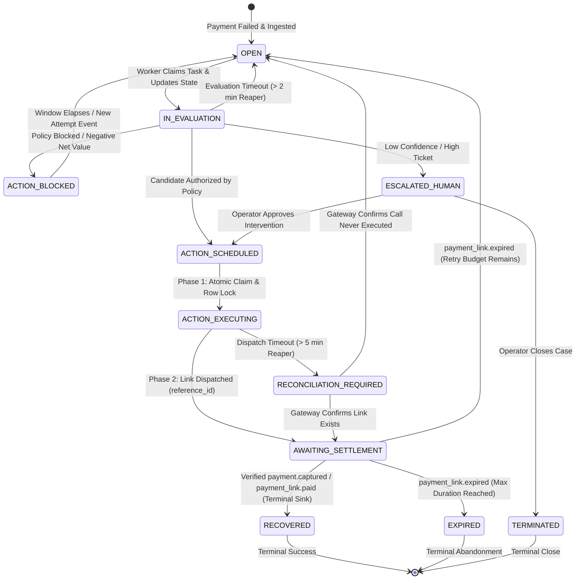

# Domain Model & Terminology Specification

**Document Status:** Pending Architecture Review
**Project:** Razorpay AI Buildathon 2026 — Track 03 (LIFT Engine)

---

## 1. Domain Concept Taxonomy

To ensure conceptual clarity and prevent ambiguous fintech jargon, LIFT enforces a strict, consistent domain terminology.

```mermaid
classDiagra    class Merchant {
        +UUID id
        +String name
        +String timezone
        +String idempotency_salt
        +PolicyProfile active_policy
    }
    class Customer {
        +UUID id
        +String external_customer_id
        +ContactProfile contact
        +Integer risk_tier
        +Integer rolling_contacts_7d
        +DateTime last_contacted_at
    }
    class PaymentAttempt {
        +UUID id
        +UUID recovery_opportunity_id
        +String razorpay_payment_id
        +String razorpay_order_id
        +Integer attempt_sequence
        +Decimal amount
        +String currency
        +PaymentMethod method
        +AttemptStatus status
        +FailureRecord failure
        +DateTime gateway_created_at
        +DateTime ingested_at
    }
    class RecoveryOpportunity {
        +UUID id
        +UUID merchant_id
        +UUID customer_id
        +String order_id
        +UUID initial_attempt_id
        +UUID latest_attempt_id
        +OpportunityState state
        +Decimal amount_at_risk
        +Decimal organic_recovery_estimate
        +Integer failure_attempt_count
        +Integer total_interventions_count
        +Integer total_contacts_count
        +Integer version
        +DateTime opened_at
        +DateTime closed_at
        +DateTime last_evaluated_at
        +DateTime execution_claimed_at
    }
    class InterventionCandidate {
        +UUID id
        +InterventionType type
        +InterventionParameters params
        +Decimal p_recovery
        +Decimal p_organic
        +Decimal direct_cost
        +Decimal friction_cost
        +Decimal risk_penalty
        +Decimal expected_net_value
        +ModelConfidence confidence
    }
    class RecoveryDecision {
        +UUID id
        +DecisionType outcome
        +UUID selected_candidate_id
        +PolicyEvaluation policy_result
        +String blocked_reason_code
        +String decision_rationale
        +DateTime decided_at
    }
    class ExecutionRecord {
        +UUID id
        +UUID decision_id
        +Integer attempt_index
        +String reference_id
        +String idempotency_key
        +ExecutionStatus status
        +String external_reference_id
        +DateTime claimed_at
        +DateTime executed_at
        +Json payload
    }
    class PaymentEvidence {
        +UUID id
        +UUID recovery_opportunity_id
        +String razorpay_payment_id
        +String event_type
        +String signature_hash
        +DateTime verified_at
    }
    class AuditEvent {
        +UUID id
        +UUID merchant_id
        +String trace_id
        +String aggregate_type
        +UUID aggregate_id
        +String action
        +Json state_diff
        +DateTime timestamp
    }

    Merchant "1" --> "*" Customer : serves
    Customer "1" --> "*" PaymentAttempt : initiates
    RecoveryOpportunity "1" --> "1..*" PaymentAttempt : tracks_attempts
    RecoveryOpportunity "1" --> "*" InterventionCandidate : evaluates
    RecoveryOpportunity "1" --> "0..1" RecoveryDecision : resolves_with
    RecoveryDecision "1" --> "0..1" ExecutionRecord : authorizes
    RecoveryOpportunity "1" --> "0..1" PaymentEvidence : verified_by
    RecoveryOpportunity "1" --> "*" AuditEvent : logs
```

---

## 2. Core Concepts & Definitions

### 2.1 `PaymentAttempt` & Circular Relationship Handling
- **Definition:** An individual transaction attempt initiated through the payment gateway representing an attempt to settle an order balance.
- **Multi-Attempt Association (REQ-08):** A single merchant `order_id` frequently experiences multiple payment attempts over time.
- **Circular Insertion Procedure:**
  To safely resolve the circular foreign-key relationship between `payment_attempts` and `recovery_opportunities` in PostgreSQL without violating constraints:
  ```sql
  -- Step 1: Insert payment attempt with null opportunity reference
  INSERT INTO payment_attempts (id, customer_id, razorpay_payment_id, razorpay_order_id, ..., recovery_opportunity_id)
  VALUES (:attempt_id, :customer_id, :pay_id, :order_id, ..., NULL);

  -- Step 2: Insert recovery opportunity referencing initial attempt (latest_attempt_id = initial_attempt_id)
  INSERT INTO recovery_opportunities (id, merchant_id, customer_id, order_id, initial_attempt_id, latest_attempt_id, ...)
  VALUES (:opp_id, :merchant_id, :customer_id, :order_id, :attempt_id, :attempt_id, ...);

  -- Step 3: Link attempt back to the new opportunity
  UPDATE payment_attempts SET recovery_opportunity_id = :opp_id WHERE id = :attempt_id;
  ```
  This procedure runs inside a single database transaction.

### 2.2 `FailureDiagnosis`
- **Definition:** The structured classification and root-cause mapping of a failed payment attempt.
- **Actionable Categories:**
  1. *Transient Network/Gateway Outage* (eligible for short delay retry or soft payment link).
  2. *Insufficient Funds / Limit Exceeded* (eligible for scheduled payment link timed with morning quiet-hours exit).
  3. *Customer Authentication Dropoff / 3DS Timeout* (eligible for immediate dynamic Razorpay Payment Link with alternate rails).
  4. *Invalid Instrument / Expired Card* (eligible for update-instrument notification with payment link).
  5. *Hard Issuer Decline / Fraud Block* (ineligible for retries; requires customer contact or hard stop).

### 2.3 `RecoveryOpportunity`
- **Definition:** The stateful aggregate managing the lifecycle of recovering revenue for a failed order.
- **Key Fields & Invariants:**
  - `(merchant_id, order_id)` is unique: exactly one active recovery opportunity per order.
  - `initial_attempt_id`: The first failed attempt that opened the opportunity.
  - `latest_attempt_id`: Always set to `initial_attempt_id` upon creation, updated on subsequent attempts. Never NULL.
  - `total_interventions_count`: Monotonically incremented counter owned strictly by this aggregate to allocate `attempt_index`.
  - `current_state`: Monotonic state machine tracking lifecycle.

### 2.4 `InterventionCandidate` & Execution Semantics
- **Definition:** A specific, parameterized potential action evaluated economically by the system.
- **Authority Boundary (REQ-02):** Candidates are generated and scored deterministically by the Decision Engine. The LLM does NOT select or authorize candidates.
- **Permitted Types & Execution Paths:**
  - `PASSIVE_WAIT`: Do nothing; allow organic recovery window. Zero customer contact.
  - `INTERNAL_RETRY_SCHEDULE`: **Scheduled Payment Link Dispatch**. Schedules a future Payment Link creation and customer delivery task in `task_queue` (e.g. delayed until morning quiet-hours exit). The execution path is strictly:
    $$\text{Candidate} \rightarrow \text{Enqueue task in task\_queue with scheduled\_at} \rightarrow \text{Worker wakes up} \rightarrow \text{Atomic policy \& state re-check under row lock} \rightarrow \text{Razorpay Payment Link creation} \rightarrow \text{Reconciliation}$$
    *Invariant:* Direct card re-debiting is explicitly excluded as unsupported without subscription mandates under RBI regulations.
  - `PAYMENT_LINK_DISPATCH`: Immediately issue dynamic Razorpay Payment Link with custom payment rails (UPI, Netbanking, Cards) and customer dispatch (SMS/WhatsApp/Email). Counts as customer contact.
  - `CUSTOMER_OUTREACH`: Send contextual notification prompting customer action. Counts as customer contact.
  - `OPERATOR_ESCALATION`: Route case to merchant's billing operations queue. Zero customer contact.

### 2.5 `InterventionEconomics` & Fully Computable Mathematical Formulation
The quantitative model calculates Expected Net Incremental Recovery Value (NIRV):
$$\text{NIRV}(a, i) = \Big[ P(\text{Rec} \mid a, \mathbf{x}_i) - P(\text{Organic} \mid \mathbf{x}_i) \Big] \times \text{AmountAtRisk}(i) - \text{DirectCost}(a) - \text{FrictionCost}(a, c_i) - \text{RiskPenalty}(i)$$

Where:
1. **$\text{AmountAtRisk}(i)$:** The gross order value stored as an integer number of currency subunits (paise for INR).
2. **$\text{FrictionCost}(a, c_i)$ (Customer LTV Buildathon Proxy):**
   In transactional commerce and digital checkout recovery, the order value at risk is the only directly observable, non-speculative anchor of immediate customer relationship value. Rather than inventing an ungrounded, speculative `CustomerLTV` prediction model without training data, LIFT defines:
   $$\text{FrictionCost}(a, c_i) = \lambda_{\text{friction}} \times \text{AmountAtRisk}(i) \times \text{ContactFatigue}(c_i, a, t)$$
   - $\lambda_{\text{friction}} = 0.05$ (dimensionless scaling factor, default 5% of order value per base contact unit).
3. **$\text{RiskPenalty}(i)$ (Model Uncertainty Representation):**
   Rather than claiming fake Gaussian standard error $\sigma_{\text{rec}}$, prediction uncertainty is derived directly from the calibrated classification margin:
   $$\text{Uncertainty}(i) = 1.0 - \text{confidence\_score}(i) \in [0.0, 0.50]$$
   $$\text{RiskPenalty}(i) = \beta \times \text{Uncertainty}(i) \times \text{AmountAtRisk}(i)$$
   - $\beta = 0.10$ (dimensionless uncertainty penalty weight, default 10% maximum haircut).
4. **$P(\text{Organic} \mid \mathbf{x})$ & Global Priors:**
   - Shrunk toward the deterministic global prior dictionary `GLOBAL_FAILURE_PRIORS` when segment observations $N_{\text{obs}} < 30$:
     - `TRANSIENT_NETWORK`: 0.40
     - `AUTHENTICATION_TIMEOUT`: 0.30
     - `INSUFFICIENT_FUNDS`: 0.15
     - `INVALID_INSTRUMENT`: 0.05
     - `HARD_ISSUER_DECLINE`: 0.01

### 2.6 Deterministic Contact Fatigue Function (Fully Implementable)
Customer friction is computed deterministically from existing database fields:
$$\text{ContactFatigue}(c, a, t) = \begin{cases} 0.0 & \text{if } a \text{ does not contact customer} \\ w(a) \times \Big( 1.0 + R(t, t_{\text{last}}) + 0.5 \times N \Big) & \text{if } a \text{ contacts customer} \end{cases}$$

- **Inputs from Schema:**
  - $N = \text{customers.rolling\_contacts\_7d} \in \mathbb{N}_{\ge 0}$.
  - $t_{\text{last}} = \text{customers.last\_contacted\_at}$ (nullable timestamp).
  - $t$: Current UTC evaluation timestamp.
  - $w(a)$: Channel intrusion weight:
    - $\text{SMS} = 1.0$
    - $\text{WhatsApp} = 1.5$
    - $\text{Email} = 0.4$
    - Default = 1.0.
- **Recency Decay $R(t, t_{\text{last}})$:**
  - If $t_{\text{last}}$ is `NULL`: $R = 0.0$.
  - Else:
    $$\Delta h = \max\left(0.0, \frac{t - t_{\text{last}}}{3600\text{ seconds}}\right)$$
    $$R(t, t_{\text{last}}) = \exp\left(-\frac{\Delta h}{48.0}\right)$$
- **Range & Invariants:**
  - Range: $[0.0, \infty)$, evaluated to 4 decimal places.
  - Behavior when $N = 0$ and $t_{\text{last}} = \text{NULL}$: $\text{ContactFatigue} = w(a) \times 1.0$ (clean base touch cost).
  - Cutoff: If $\text{ContactFatigue} \ge 4.0$ or $N \ge \text{policy.max\_contacts\_7d}$ (default 3), the deterministic policy gate hard-blocks customer outreach (`BLOCKED_CONTACT_LIMIT`).

### 2.7 `RecoveryDecision`
- **Definition:** The authoritative resolution produced by the **Deterministic Policy Engine**.
- **Outcomes:** `AUTHORIZED`, `BLOCKED` (with deterministic reason code), `ESCALATED`, `NO_ACTION`.

### 2.8 `ExecutionRecord`, `attempt_index` & Idempotency Key Specification
- **Ownership of `attempt_index`:** Owned strictly by `RecoveryOpportunity.total_interventions_count`.
- **Deterministic `reference_id`:**
  To guarantee external correlation without claiming unsupported Razorpay idempotency headers:
  $$\text{reference\_id} = \text{"ref\_" + str(opportunity\_id).replace("-", "")[:16] + "\_" + str(attempt\_index)}$$
  Stored in `execution_records.reference_id` prior to dispatch and passed to Razorpay's `reference_id` parameter.
- **Idempotency Key Canonical Construction:**
  $$\text{idempotency\_key} = \text{SHA256}(\text{UTF8}(\text{opportunity\_id} + ":" + \text{intervention\_type} + ":" + \text{str}(\text{attempt\_index}) + ":" + \text{merchant\_salt}))$$
  - `merchant_salt` is loaded securely from `merchants.idempotency_salt` (a cryptographically secure 32-byte hex string generated at merchant onboarding; never exposed to API or UI).

### 2.9 `PaymentEvidence` & Out-of-Order Lifecycle Semantics
- **Definition:** Authenticated cryptographic proof confirming payment settlement.
- **Handling of `payment.authorized`:**
  - `payment.authorized` represents funds reserved at the bank, but NOT settled.
  - It inserts a `PaymentAttempt` with `status = 'authorized'`, and sets/keeps opportunity in `AWAITING_SETTLEMENT`. It does **not** mark the opportunity `RECOVERED`.
- **Handling of `payment.captured` / `payment_link.paid` / `order.paid`:**
  - Represents final settlement. Inserts `PaymentEvidence` and transitions opportunity monotonically to `RECOVERED`.
  - Once in `RECOVERED`, the state is an immutable terminal sink. Delayed failure events are recorded for audit but cannot roll back state.
- **Handling of `payment_link.expired`:**
  - If a link expires while in `AWAITING_SETTLEMENT`:
    - If overall opportunity recovery window ($< 72\text{ hours}$) and attempt budget remain: transitions back to `OPEN` for subsequent scheduled intervention.
    - If opportunity window has elapsed: transitions to terminal `EXPIRED`.

### 2.10 `AuditEvent`
- **Definition:** Append-only log of all system transitions, containing `merchant_id` for scoping and replayability.

---

## 3. Lifecycle State Machines

### 3.1 `RecoveryOpportunity` State Machine


### 3.2 State Transition Invariants
1. **Monotonic Terminal Sink:** `RECOVERED` is terminal and immutable. Out-of-order `payment.failed` webhooks cannot revert it.
2. **Settlement Proof Invariant:** An opportunity cannot transition to `RECOVERED` on `payment.authorized` alone; verified capture evidence is strictly required.
3. **Atomic Claim & Contact Increment Invariant:** In Phase 1, under row lock, if the selected action contacts the customer, `customers.rolling_contacts_7d` is incremented and `last_contacted_at` is updated before the claim transaction commits.
4. **Stuck-Worker Reaper:** Tasks in `IN_EVALUATION` $> 2\text{ min}$ reset to `OPEN`; records in `ACTION_EXECUTING` $> 5\text{ min}$ transition to `RECONCILIATION_REQUIRED` for gateway status polling.
r.
