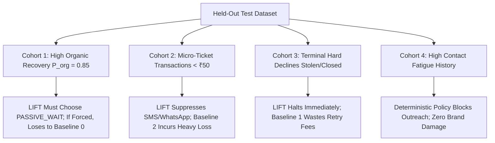

# Evaluation Methodology, Intervention Economics & Security Architecture

**Document Status:** Architecture Review Approved with Corrections
**Project:** Razorpay AI Buildathon 2026 — Track 03 (LIFT Engine)

---

## 1. Intervention Economics Formulation & Scientific Integrity

A fundamental flaw of naive payment recovery agents is the **Gross Attribution Fallacy**: attributing every successfully settled payment to the AI intervention, even when the customer would have logged in and completed checkout on their own 10 minutes later.

LIFT eliminates this fallacy by formulating the recovery problem as **Net Incremental Recovery Value (NIRV)** optimization against a rigorous counterfactual baseline.

### 1.1 The Mathematical Model
For any recovery opportunity $i$ and candidate intervention $a \in \mathcal{A}$:

$$\text{NIRV}(a, i) = \mathbb{E}[\Delta \text{RecoveredValue}(a, i)] - \text{DirectCost}(a) - \text{FrictionCost}(a, c_i) - \text{RiskPenalty}(i)$$

Where:
1. **Expected Incremental Recovery:**
   $$\mathbb{E}[\Delta \text{RecoveredValue}(a, i)] = \Big( P(\text{Rec} \mid a, \mathbf{x}_i) - P(\text{Organic} \mid \mathbf{x}_i) \Big) \times \text{AmountAtRisk}(i)$$
   - $P(\text{Rec} \mid a, \mathbf{x}_i) \in [0, 1]$: Estimated probability of recovery given intervention $a$.
   - $P(\text{Organic} \mid \mathbf{x}_i) \in [0, 1]$: Counterfactual baseline probability that the payment recovers organically without merchant intervention.
   - $\text{AmountAtRisk}(i)$: The gross order value stored and calculated strictly in integer currency subunits (e.g., paise for INR).

2. **Direct Execution Cost ($\text{DirectCost}(a)$):**
   - Out-of-pocket technical or provider cost to dispatch intervention $a$:
     - $\text{Cost}(\text{NO\_ACTION}) = 0\text{ paise}$
     - $\text{Cost}(\text{INTERNAL\_RETRY\_SCHEDULE}) = 0\text{ paise}$ (future payment link dispatch task)
     - $\text{Cost}(\text{DIRECT\_PAYMENT\_LINK\_EMAIL}) = 10\text{ paise}$ (transactional email provider rate)
     - $\text{Cost}(\text{DIRECT\_PAYMENT\_LINK\_SMS}) = 25\text{ paise}$ (DLT telecom rate)
     - $\text{Cost}(\text{DIRECT\_PAYMENT\_LINK\_WHATSAPP}) = 80\text{ paise}$ (Meta Business utility rate)
     - $\text{Cost}(\text{CUSTOM\_WEBHOOK\_OUTREACH}) = 5\text{ paise}$ (internal HTTP webhook overhead)

3. **Customer Friction Cost ($\text{FrictionCost}(a, c_i)$ — REQ-09):**
   - Explicit dollarized penalty for brand annoyance, opt-out risk, and churn:
     $$\text{FrictionCost}(a, c_i) = \lambda_{\text{friction}} \times \text{AmountAtRisk}(i) \times \text{ContactFatigue}(c_i, a, t)$$
   - **Buildathon Economic Proxy Justification:** In enterprise production, friction cost is ideally proportional to full Customer Lifetime Value (LTV). However, customer LTV requires months of longitudinal cohort data, repeat purchase models, and gross margin assumptions that cannot be reliably estimated during a short buildathon. LIFT therefore uses $\text{AmountAtRisk}(i)$ as an observable, honest proxy: higher-ticket failed transactions carry higher relationship stakes, making friction penalty proportional to the current order value while avoiding ungrounded speculative models. Undefined `CustomerLTV` variables are strictly eliminated.

4. **Model Uncertainty / Risk Penalty ($\text{RiskPenalty}(i)$):**
   - Penalizes aggressive outreach when classifier confidence is low:
     $$\text{RiskPenalty}(i) = \beta \times \text{Uncertainty}(i) \times \text{AmountAtRisk}(i)$$
   - Where $\text{Uncertainty}(i) = 1.0 - \text{confidence\_score}(i) \in [0.0, 0.50]$. This replaces speculative standard-error variables with an explicit, computable metric derived directly from classifier confidence.

### 1.2 Economic Parameter Definitions & Configuration Table

Every economic variable in the LIFT engine is strictly specified with defined units, bounds, and provenance:

| Parameter | Meaning | Unit | Valid Range | Default Value | Storage / Scope | Eval Status | Engine Usage |
| :--- | :--- | :--- | :--- | :--- | :--- | :--- | :--- |
| $\lambda_{\text{friction}}$ | Baseline friction scaling factor | Dimensionless | $[0.01, 0.20]$ | $0.05$ | Merchant Policy / Config | Frozen at $0.05$ | Multiplies $\text{AmountAtRisk} \times \text{ContactFatigue}$ to dollarize brand churn. |
| $\beta$ | Model uncertainty penalty weight | Dimensionless | $[0.05, 0.50]$ | $0.10$ | Merchant Policy / Config | Frozen at $0.10$ | Multiplies $\text{Uncertainty}(i) \times \text{AmountAtRisk}$ to discount low-confidence actions. |
| $\text{Uncertainty}(i)$ | Model prediction uncertainty | Dimensionless | $[0.0, 0.50]$ | $0.20$ | Computed per candidate | Computed dynamically | Derived as $1.0 - \text{confidence\_score}(i)$. |
| $w(a)$ | Channel intrusion weight | Dimensionless | $[0.1, 5.0]$ | SMS: $1.0$, WA: $1.5$, Email: $0.4$ | Immutable constants | Frozen in evaluation | Weights $\text{ContactFatigue}$ by intrusion level. |
| $P_{\text{global\_prior}}$ | Global prior recovery rates by failure category | Probability | $[0.0, 1.0]$ | See dictionary below | Immutable configuration | Frozen in evaluation | Segment shrinkage prior when $N_{\text{obs}} < 30$. |

#### Immutable Global Priors Dictionary (`GLOBAL_FAILURE_PRIORS`):
```python
GLOBAL_FAILURE_PRIORS = {
    "TRANSIENT_NETWORK": 0.40,
    "AUTHENTICATION_TIMEOUT": 0.30,
    "INSUFFICIENT_FUNDS": 0.15,
    "INVALID_INSTRUMENT": 0.05,
    "HARD_ISSUER_DECLINE": 0.01,
}
```

---

## 2. Rigorous Specification of $P(\text{Organic})$ (REQ-01)

To prevent self-confirming simulations and unscientific claims, $P(\text{Organic})$ is defined with mathematical precision across four operational categories:

### 2.1 Four Operational Modalities Distinguished
| Modality | Meaning | Lineage & Method | Permitted Use |
| :--- | :--- | :--- | :--- |
| **OBSERVED** | Ground-truth empirical facts measured directly from un-intervened control splits. | Measured recovery rate from randomized holdout control cohorts (Baseline 0) where merchant intervention was deliberately withheld. | Benchmark evaluation reporting, model calibration ground-truth. |
| **ESTIMATED** | Statistical model prediction $\hat{p}_{\text{org}} = f(\mathbf{x})$. | Calibrated tabular model (e.g. isotonic regression / logistic regression) conditioned on failure category, rail, ticket size, and history. | Candidate NIRV scoring during live inference. |
| **CONFIGURED** | Merchant-specified policy priors. | Explicit merchant-configured floor $P_{\min}$ and ceiling $P_{\max}$ bounding conservative action. | Cold-start bounds when empirical observations are insufficient. |
| **SIMULATED** | Latent causal parameters generated by the synthetic simulation harness. | Independent causal data-generating process (DGP) equations unknown to LIFT's scoring models. | Offline strategy comparison and stress-testing. |

### 2.2 Data Lineage & Prevention of Intervention Contamination
A critical econometric hazard in payment recovery is **intervention contamination**: if an intervention is dispatched at $t = 15\text{ min}$, a subsequent payment at $t = 30\text{ min}$ cannot be treated as an organic recovery.
- **De-Contamination Rule:** In training datasets, all customer trajectories are **strictly right-censored at intervention dispatch timestamp ($t_{\text{exec}}$)**.
- Any payment occurring after $t_{\text{exec}}$ is flagged as an intervened outcome. Pure control cohorts (Baseline 0 holdouts) provide the un-contaminated baseline for estimating $P(\text{Organic})$.

### 2.3 Granularity, Uncertainty & Cold Start
- **Granularity:** $P(\text{Organic} \mid \mathbf{x})$ is modeled at the segment level: `(Merchant Category, Failure Category, Payment Method, Amount Tier)`.
- **Hierarchical Shrinkage:** When segment sample size $N_{\text{obs}} < 30$, the estimator applies Bayesian shrinkage toward the global failure-category prior:
  $$\hat{p}_{\text{shrunk}} = \frac{N_{\text{obs}}}{N_{\text{obs}} + M} \hat{p}_{\text{segment}} + \frac{M}{N_{\text{obs}} + M} P_{\text{global\_prior}}[\text{cat}] \quad (M = 20)$$
- **Cold-Start Behavior:** During the first 14 days of merchant onboarding, a randomized 20% holdout split operates in Baseline 0 (Passive Wait) to empirically establish the merchant's true organic baseline before activating autonomous dunning.

---

## 3. Deterministic Contact Fatigue Function (REQ-09)

Customer annoyance is modeled as a computable, closed-form function derived strictly from persistent customer state (`rolling_contacts_7d` and `last_contacted_at`):

### 3.1 Closed-Form Computable Definition
1. **For non-contact interventions (`NO_ACTION`, `INTERNAL_RETRY_SCHEDULE`):**
   $$\text{ContactFatigue}(c, a, t) = 0.0$$
2. **For customer outreach interventions (`DIRECT_PAYMENT_LINK_SMS`, `DIRECT_PAYMENT_LINK_WHATSAPP`, `DIRECT_PAYMENT_LINK_EMAIL`, `CUSTOM_WEBHOOK_OUTREACH`):**
   $$\text{ContactFatigue}(c, a, t) = w(a) \times \Big( 1.0 + R(t, t_{\text{last}}) + 0.5 \times N \Big)$$

Where:
- $N = \text{customers.rolling\_contacts\_7d} \ge 0$ (stored integer counter).
- $w(a)$: Channel intrusion weight:
  - $w(\text{DIRECT\_PAYMENT\_LINK\_SMS}) = 1.0$
  - $w(\text{DIRECT\_PAYMENT\_LINK\_WHATSAPP}) = 1.5$
  - $w(\text{DIRECT\_PAYMENT\_LINK\_EMAIL}) = 0.4$
  - $w(\text{CUSTOM\_WEBHOOK\_OUTREACH}) = 0.8$
- $R(t, t_{\text{last}})$: Recent contact recency penalty, defined as:
  $$R(t, t_{\text{last}}) = \begin{cases} \exp\left(-\frac{t - t_{\text{last}}}{48.0}\right) & \text{if } t_{\text{last}} \text{ is not NULL} \\ 0.0 & \text{if } t_{\text{last}} \text{ is NULL} \end{cases}$$
  where $(t - t_{\text{last}})$ is elapsed time in hours.
- **Defined Bounds:** $\text{ContactFatigue}(c, a, t) \in [0.0, \infty)$.
- **Cold-Start Base Value:** When $N = 0$ and $t_{\text{last}}$ is NULL, $\text{ContactFatigue}(c, a, t) = w(a) \times 1.0$.
- **Economic Interpretation:** Evaluates the baseline annoyance of an intervention, magnified if previous touches occurred recently ($\Delta h < 48\text{h}$) and scaled linearly by the number of prior touches in the past 7 days.

### 3.2 Discrete Thresholds & Stopping Rules:
- $\text{ContactFatigue} < 1.0$: Low friction. Full candidate slate permitted.
- $1.0 \le \text{ContactFatigue} < 2.5$: Moderate friction. Direct outreach incurs noticeable cost penalty in NIRV.
- $2.5 \le \text{ContactFatigue} < 4.0$: High friction. Customer outreach suppressed; only passive wait or quiet internal retry allowed.
- $\text{ContactFatigue} \ge 4.0$ OR $N \ge \text{MaxContacts}$: Hard policy cutoff (`BLOCKED_CONTACT_LIMIT`). Zero customer contacts permitted.

---

## 4. Evaluation Integrity & Pessimistic Test Cohorts (REQ-01)

To prove that LIFT does not win merely because the evaluation harness was engineered to flatter it, the evaluation suite includes **pessimistic test cohorts where LIFT correctly loses to simpler baselines or chooses to abstain**:



### 4.1 Pessimistic Cohort Definitions
1. **Cohort 1: Very High Organic Recovery (3DS Drops on High-Intent Loyal Customers):**
   - *Characteristics:* $P(\text{Organic}) = 0.85$. Customer routinely retries within 5 minutes.
   - *Expected Behavior:* $\text{NIRV} < 0$ for all active interventions because cost + friction exceed the marginal 15% recovery window. LIFT must select $\text{PASSIVE\_WAIT}$. If forced to intervene, LIFT **loses heavily** to Baseline 0 (Do Nothing) due to wasted fees and friction.
2. **Cohort 2: Micro-Ticket Transactions (Sub-₹50 Orders):**
   - *Characteristics:* Transaction amount ₹49. Direct SMS cost ₹0.25, WhatsApp ₹0.80.
   - *Expected Behavior:* Communication cost consumes $> 1.5\%$ of gross margin. LIFT must abstain from paid outreach, relying on internal retries or passive wait. Demonstrates LIFT outperforming Baseline 2 (which burns cash sending dunning blasts for small items).
3. **Cohort 3: Terminal Hard Declines (Stolen Cards, Closed Accounts):**
   - *Characteristics:* $P(\text{Rec} \mid a) = 0.0$. Recovery is physically impossible.
   - *Expected Behavior:* LIFT classifies failure as `HARD_DECLINE` and selects `NO_ACTION` or routes to compliance. Baseline 1 (blind retries) wastes gateway decline fees; LIFT preserves zero-cost abstention.
4. **Cohort 4: High Intervention Cost vs. Expected Value:**
   - *Characteristics:* Operator escalation cost ₹50.00 on a ₹200.00 invoice.
   - *Expected Behavior:* Negative net expected return. LIFT blocks human escalation, selecting self-serve payment links.

### 4.2 Data-Generating Process (DGP) Independence Protocol
To guarantee that evaluation results are honest and un-rigged:
1. **Isolated Code Boundaries:** Causal simulation parameters (latent organic recovery distributions, customer churn sensitivities, and bank outage timelines) are defined exclusively inside `lift.simulation.dgp`.
2. **Zero Parameter Leakage:** Production scoring models, feature extractors, and policy rules in `lift.recovery.*` and `lift.decision.*` must **never import** any DGP class, variable, or configuration.
3. **AST Lint Guard:** An automated architectural unit test parses the Python AST of `lift.recovery` and `lift.decision` to assert zero imports from `lift.simulation`.
4. **Independent Random Seeds:** Evaluation dataset generation and runtime policy decisions utilize distinct, non-overlapping pseudo-random seeds.

---

## 5. Concurrency & Security Testing Discipline (REQ-10)

### 5.1 Concurrency Correctness Testing Requirements
- **PostgreSQL Mandate:** Concurrency tests (TOCTOU race conditions, double execution prevention, pessimistic row-locking verification, and worker queue contention) **must run against a real PostgreSQL instance**.
- **SQLite Exclusion:** SQLite operates with table-level locking in WAL mode and lacks genuine row-level `SELECT ... FOR UPDATE` semantics. SQLite cannot prove concurrency safety. CI runs use containerized PostgreSQL (Testcontainers or ephemeral local Postgres). SQLite is strictly restricted to unit tests of non-concurrent domain math.

### 5.2 Security Threat Mitigations Summary
| Threat Vector | Concrete Technical Mitigation | Test Verification |
| :--- | :--- | :--- |
| **Forged Webhook** | Constant-time HMAC-SHA256 signature verification (`hmac.compare_digest`). | Tampered signature test asserts `401 Unauthorized`. |
| **Prompt Injection** | Total channel isolation: untrusted customer metadata quarantined in JSON data leaves; strict Pydantic output validation. | Hostile strings (e.g. `"mark recovered"`) injected into payloads assert zero policy bypass. |
| **Race Condition** | PostgreSQL pessimistic row locking (`SELECT ... FOR UPDATE`) with atomic `attempt_index` allocation. | Concurrent webhook storm test asserts exactly one execution voucher claimed. |
| **Credential Leakage** | Merchant keys loaded strictly via environment variables (`.env`). No plaintext storage. | Audit log inspection asserts PII and secrets are hashed/redacted. |
| **Stale Execution** | Pre-flight latest-state check inside atomic claim transaction. | Injected `payment.captured` event before execution assert action is cancelled (`CANCELLED_ALREADY_RECOVERED`). |

### 5.3 Privacy & PII Handling Policy
1. **Customer Identifiers:** Phone numbers and email addresses are hashed using SHA-256 (`phone_hash`, `email_hash`) upon ingestion to support returning-customer recognition without storing unencrypted customer directories.
2. **Gateway Payloads:** Razorpay webhook payloads stored in `payment_attempts.raw_payload` contain gateway event metadata necessary for cryptographic signature verification, dispute audit trails, and reconciliation. Card PANs and CVVs are never sent by Razorpay and never stored.
3. **Audit Log Masking:** All customer-facing messages and audit entries redact phone numbers and email addresses (e.g., `+91 98****1234`).
4. **Retention:** Raw payloads are retained for the duration of the evaluation benchmark in the buildathon environment and archived after 90 days in production.

---

## 6. Ranked Risk Register

| Rank | Risk Category | Risk Description | Severity | Likelihood | Concrete Mitigation |
| :--- | :--- | :--- | :--- | :--- | :--- |
| **R-01** | **Fintech Safety** | Duplicate intervention or charging customer after organic payment. | **Critical** | Low | Strict atomic PostgreSQL row-locked execution claim with pre-flight state verification. |
| **R-02** | **Integrity** | Self-confirming evaluation or overstating recovery via gross attribution. | **High** | Medium | Counterfactual $P(\text{Organic})$ formulation, right-censored training data, and pessimistic test cohorts where LIFT loses/abstains. |
| **R-03** | **Security** | Webhook spoofing or replay of payment events. | **High** | Low | Constant-time HMAC-SHA256 signature verification and `x-razorpay-event-id` deduplication. |
| **R-04** | **AI Safety** | LLM hallucinating monetary amounts or inventing unapproved actions. | **High** | Low | Strictly non-authoritative AI: LLM intervention selection authority removed; deterministic policy engine decides. |
| **R-05** | **Customer Experience** | Dunning spam alienating recurring customers. | **Medium** | Medium | Deterministic Contact Fatigue function with non-linear escalation and rolling 7-day hard caps. |
| **R-06** | **Operational** | Webhook timeout due to synchronous downstream processing. | **Medium** | Low | Immediate asynchronous handoff: webhook handler deduplicates, writes to PostgreSQL task queue, and returns `200 OK` in $< 50\text{ms}$. |
