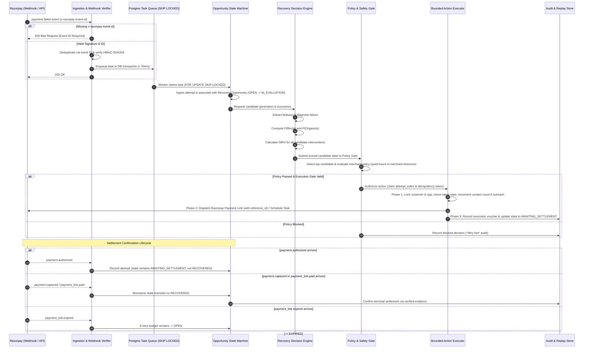

# Product Specification: Intelligent Revenue Recovery Engine

**Internal Working Name:** LIFT (*Provisional — subject to brand finalization*)
**Track:** Razorpay AI Buildathon 2026 — Track 03: AI Revenue Recovery
**Document Status:** Pending Architecture Review
**Date:** 2026-09-05

---

## 1. Executive Summary & Problem Definition

### 1.1 The Exact Problem
In modern digital commerce and SaaS recurring billing, payment failures are common (ranging from 5% to over 20% depending on geography, payment method, and merchant vertical). However, the standard merchant response is crude:
- **Blind programmatic retries:** Retrying cards at static intervals (e.g., +24h, +48h), which triggers issuer decline throttles, incurs decline fees, or fails repeatedly on hard declines.
- **Indiscriminate customer outreach:** Blasting generic WhatsApp, SMS, or email payment reminders for every decline, causing severe customer annoyance, high unsubscribe rates, communication costs, and brand fatigue.
- **Unearned incentives:** Offering discounts or waived fees to customers who would have retried and paid organically on their own.
- **Silent churn:** Abandoning soft failures that could have been recovered with a low-friction dynamic payment link or tailored channel notification.

Most existing "AI payment recovery" tools treat the problem as either a simple binary prediction task (*"Will this payment fail?"*) or an automated outreach bot (*"Send a friendly AI email whenever a payment fails"*).

### 1.2 The LIFT Core Hypothesis
LIFT treats revenue recovery as a **constrained, economic intervention-decisioning problem**.

The core operational question is **not**:
> *"Will this failed payment recover?"*

The core operational question is:
> **"What is the best permitted intervention for this recovery opportunity, why is it preferable to alternatives, what incremental net value is expected, and what verified evidence confirms the final outcome?"**

### 1.3 Core Product Principles
1. **AI diagnoses and assists:** Probabilistic failure diagnosis, semantic error categorization, personalized notification drafting, and plain-language decision explanations. The LLM has zero authority to select, rank, or authorize actions.
2. **Deterministic software decides:** Economic candidate evaluation, hard constraints, policy enforcement, contact frequency caps, quiet hours, and stopping rules are strictly deterministic code. The deterministic policy engine chooses the permitted winning intervention.
3. **Bounded executors act:** Side-effecting operations (dispatching a Razorpay Payment Link, scheduling an internal retry via `RetryStrategyExecutor`, dispatching a customer notification) execute through isolated, idempotent, single-purpose adapters.
4. **Verified payment evidence confirms:** An opportunity is recovered *only* when an authenticated, cryptographically verified payment capture event is received. AI never self-reports success.
5. **Important decisions are auditable:** Every evaluation, candidate score, policy gate, and blocked action generates an immutable audit record for replay and human inspection.

---

## 2. Personas & Stakeholders

### 2.1 Primary User: Revenue Operations / Billing Engineer
- **Profile:** Manages checkout health, recurring billing pipelines, payment gateway integrations, and dunning workflows.
- **Jobs to be Done:**
  - Maximize net recovered GMV while minimizing customer complaints, churn, and communication costs.
  - Set guardrails (e.g., maximum contacts per customer per week, minimum transaction threshold for SMS, approved dunning templates).
  - Understand *why* an intervention succeeded, failed, or was blocked.
  - Run simulations to forecast the economic impact of policy changes before rolling them out live.
- **Pain Points:** Lack of visibility into dunning ROI; fear of alienating high-LTV customers with spammy outreach; inability to prove incremental recovery vs. organic retries.

### 2.2 Secondary Users
- **Finance / CFO:** Wants auditable reporting showing *net incremental recovery* (recovered revenue minus intervention costs, customer friction penalties, and organic baseline) rather than vanity gross recovery figures.
- **Customer Support Lead:** Needs quick lookup for customer payment disputes or complaints regarding outreach timing.
- **Compliance / Risk Officer:** Ensures compliance with contact limits (e.g., TRAI/DND guidelines in India, quiet hours), consumer privacy, and payment scheme rules.

---

## 3. User Journeys

### 3.1 Live Event Journey (Continuous Ingestion & Action)

### 3.2 Strategic Optimization Journey ("Recovery Lab")
1. Billing manager loads historical or synthetic batch failure datasets.
2. Selects comparison strategies: **Baseline 0 (Do Nothing / Pure Organic)** vs. **Baseline 1 (Static Periodic Retry)** vs. **Baseline 2 (Naive Generic Outreach)** vs. **LIFT Intelligent Recovery Strategy**.
3. Runs batch simulation across identical held-out test splits.
4. Inspects comparative metrics: Gross Recovery, Measured Organic Recovery, Estimated Organic Recovery, Net Incremental Recovery (NIRV), Intervention Costs, Customer Friction Scores, and Blocked Decision counts.
5. Verifies pessimistic test cohorts where LIFT correctly loses or abstains (e.g. very high organic recovery, micro-ticket transactions, or hard declines).
6. Performs **Decision Replay** on outlier cases to understand why specific interventions were chosen or blocked.

---

## 4. Scope Definition

### 4.1 In Scope
- **Failure Taxonomy & Diagnosis:** Classifying raw gateway error codes and issuer steps into 5 actionable intervention classes (Transient Network, Insufficient Funds, Authentication Dropoff, Invalid Instrument, Hard Issuer Decline).
- **Intervention Synthesis:** Dynamic Razorpay Payment Links with custom payment rails, scheduled future payment link creation tasks via `RetryStrategyExecutor` (e.g., delaying outreach until morning quiet-hours exit), multi-channel notification dispatch (WhatsApp/SMS/Email mock/adapters), and operator escalation. Direct card re-debiting is explicitly excluded as unsupported without subscriptions.
- **Intervention Economics Formulation:** Rigorous mathematical modeling of expected recovery probability $P(\text{Rec} \mid a)$, counterfactual organic recovery probability $P(\text{Organic} \mid \mathbf{x})$, direct costs, customer contact fatigue costs anchored to transaction value, and net incremental recovery value (NIRV).
- **Deterministic Policy & Safety Gate:** Enforcing merchant contact caps, quiet hours evaluated in merchant timezone (`merchants.timezone`), cooldowns, minimum transaction value rules, and customer opt-outs.
- **Atomic Concurrency & Bounded Execution:** PostgreSQL pessimistic row locking (`SELECT ... FOR UPDATE`) enforcing latest-state checks, atomic contact-counter incrementing under lock, atomic `attempt_index` allocation, and deterministic idempotency vouchers.
- **Authentic Razorpay Test Mode Integration:** End-to-end support for Razorpay Test Mode APIs (Orders, Payments, Payment Links with `reference_id`) and cryptographically verified Webhooks.
- **Dual-Mode Operation:** High-throughput deterministic simulation engine for reproducible batch evaluation alongside live Test Mode execution.
- **Fintech-Grade Auditing & Replay:** Structured audit trail enabling exact step-by-step decision replay and explainable "Blocked Decision" reasons.
- **Single-Merchant Demo Scope:** Clear tenant boundary designed for a single merchant organization in the buildathon demo, avoiding unnecessary multi-tenant operational overhead.

### 4.2 Explicitly Out of Scope
- Direct credential-based automated bank account or card debit authorization without customer consent or subscription mandates.
- Unconstrained LLM-to-API execution (LLMs never formulate raw HTTP requests or authorize money movements).
- Generic universal Razorpay "smart retry" endpoint (Razorpay Smart Retries apply to Subscriptions; one-time payment recovery is managed via scheduled Payment Links and UPI/card intent).
- Real-world production money movement (strictly confined to Razorpay Test Mode and verified sandboxes).
- Real-time WebSockets or server-sent events for UI (workspace utilizes periodic polling and explicit user refresh).
- Enterprise KMS/vault systems (buildathon uses secure environment-based secret injection).

---

## 5. Value Proposition & Competitive Differentiation

| Capability | Generic Buildathon "AI Recovery Agent" | LIFT Intelligent Revenue Engine |
| :--- | :--- | :--- |
| **Primary Goal** | Send automated AI outreach or retry when payment fails | Maximize **Net Incremental Recovery Value (NIRV)** after costs, customer friction, and organic baseline |
| **Recovery Attribution** | Takes credit for all successful subsequent payments (Gross Attribution Fallacy) | Measures **Net Incremental Recovery** strictly above counterfactual $P(\text{Organic})$ |
| **Decision Authority** | LLM prompt decides action and dispatches API calls | LLM provides diagnosis and message drafts; **Deterministic Policy Engine decides winning intervention** |
| **Safety & Stopping Rules** | Ad-hoc or absent; risk of spamming or retrying settled payments | **Atomic PostgreSQL row-locked execution gate**; pre-flight latest-state verification; atomic contact-counter increment; global contact limits |
| **Failure Diagnosis** | Generic text summary of failure | Structured failure taxonomy mapped directly to permitted intervention classes |
| **Evaluation Integrity** | Anecdotal single-run demo with self-confirming assumptions | Deterministic seeded batch simulation comparing against **3 formal baseline strategies**, including cohorts where LIFT loses or abstains |
| **Auditability** | Ephemeral LLM chat logs | Immutable, structured **Decision Record & Replay Engine** with explicit blocked-action proofs |

---

## 6. Product Assumptions & Operating Constraints

1. **Gateway Authority & Monotonic Settlement:** Razorpay is the authoritative system of record for payment settlement.
   - An opportunity transitions to `RECOVERED` **only** upon verified receipt of `payment.captured`, `order.paid`, or `payment_link.paid`.
   - The event `payment.authorized` records the authorization in `payment_attempts` and transitions or holds the opportunity in `AWAITING_SETTLEMENT`, but does **not** mark it `RECOVERED` until captured.
   - Older out-of-order failure events cannot overwrite a verified `RECOVERED` state.
2. **Missing Webhook Event IDs:** Razorpay webhooks missing the authoritative `x-razorpay-event-id` header are rejected with `HTTP 400 Bad Request` and logged as security warnings. No fake event IDs are synthesized.
3. **Untrusted External Data:** Webhook payloads, customer email inputs, and payment notes are treated as untrusted data. They are sanitized and quarantined into distinct JSON leaves; never injected raw into LLM prompt instruction channels.
4. **Reproducibility:** Evaluation datasets and simulated batches must be 100% reproducible using deterministic pseudo-random seeds.
5. **Latency Budget & Task Decoupling:** Live webhook-to-response latency is `< 50 ms` (signature verification, raw persistence, and PostgreSQL queue enqueue). Downstream evaluation and execution are handled by asynchronous background workers.
6. **UI Refresh Model:** The operational dashboard relies on periodic polling (5-second cadence) and user-initiated refreshes.
7. **Credential Management:** Merchant keys and webhook secrets are injected via secure environment variables (`.env`).
